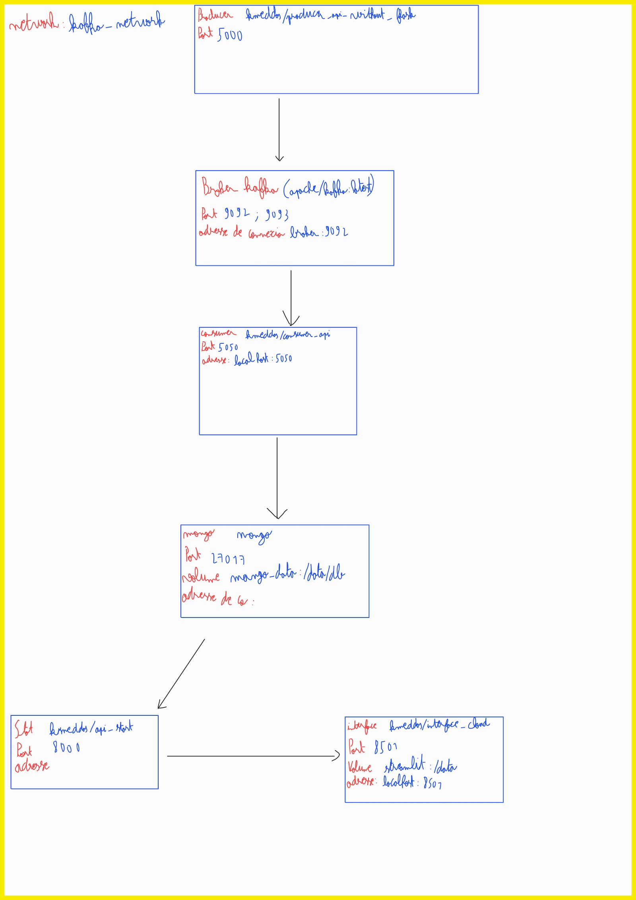

# Kafka-MongoDB Integration with Python Producers and Consumers

This project demonstrates how to integrate Kafka and MongoDB using Docker. The setup includes Python-based producer and consumer services, Kafka for message streaming, and MongoDB for data storage.

## Table of Contents
- [Overview](#overview)
- [Architecture du projet](#architecture-du-projet)
- [Project Structure](#project-structure)
- [Technologies Used](#technologies-used)
- [Setup and Installation](#setup-and-installation)
- [Useful links](#useful-links)
- [Contributors](#contributors)

---

## Overview

This project comprises:
1. A Kafka producer generating random tickets and publishing them to a Kafka topic.
2. A Kafka consumer that consumes messages from Kafka and stores them in MongoDB.
3. A user-friendly interface to monitor Kafka topics using Kafdrop.
4. A web interface to view MongoDB data using Mongo-Express.

---

## Architecture du projet



---
## Project Structure

```plaintext
.
├── build_python_mongo
│   ├── Dockerfile
│   ├── mangodb.py               # Python script for MongoDB consumer
│   └── requirement.txt     # Python dependencies
├── build_python_producer
│   ├── Dockerfile
│   ├── producer.py          # Python script for Kafka producer
│   └── requirement.txt     # Python dependencies
├── interface
│   ├── Dockerfile
│   ├── app.py          # Python script for interface
│   ├── noelbd.jpg      # image for interface
│   ├── requierement.txt
├── stats
│   ├── Dockerfile
│   ├── api_stat.py          # Python script for API statistics
│   ├── connect.py           # Python script to connect to database (MongoDB)
│   ├── requirements.txt
│   ├── statistics.py        # Collect total revenue
│   ├── statistics2.py       # Collect average revenue
│   ├── statistics3.py       # Collect revenue by product
│   ├── statistics4.py       # Collect sales by day and month
│   └── statistics5.py       # Collect revenue by day and month
├──Architecture.jpg
├── Instruction.txt
├── README.md
└── docker-compose.yml       # Docker Compose configuration file
```
---

## Technologies Used
* Docker: For containerizing services.
* Kafka: As the message broker.
* MongoDB: For storing consumed messages.
* Python: For the producer and consumer scripts.
* Streamlit : For the interface
* Flask : To check the stat file

---
## Setup and Installation

#### Prerequisites
* Docker
* Docker Compose

### Steps
1) Clone the repository:
``` bash
git clone https://github.com/kilianMeddas/projet_kafka.git
cd projet_kafka
```

2) Build Docker images for the producer and consumer: (optionnal if image still available in dockerhub) :

```bash
(in each repository)
docker build -t docker_username/producer_api_without_flask .
docker build -t docker_username/consumer_api .
docker build -t docker_username/api_stat .
docker build -t docker_username//interface_cloud .
```

3) Start all services:
```bash
docker compose up
```
or
```bash
docker-compose up
```
4) Stop all services:
```bash
docker compose down
```
or
```bash
docker-compose down
```
4) Access the services:
* Check stat: http://localhost:8000/stats   :warning: interface could bug if you look at this :warning:
* User interface : http://localhost:8501

You can add kafdrop and mango-express to have an user-friendly interface to check more deeply

## Useful links
* https://hub.docker.com/r/kmeddas/consumer_api
* https://hub.docker.com/r/kmeddas/producer_api_without_flask
* https://hub.docker.com/r/apache/kafka
* https://hub.docker.com/_/mongo
* https://hub.docker.com/r/kmeddas/api_stat
* https://hub.docker.com/r/kmeddas/interface_cloud

## Contributors
Addi Amina
Meddas Kilian
Sriwelavan Theeban
